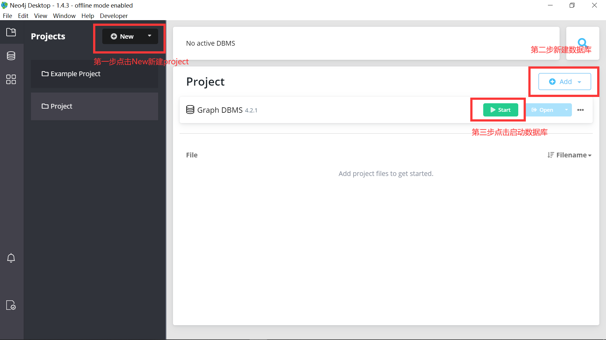
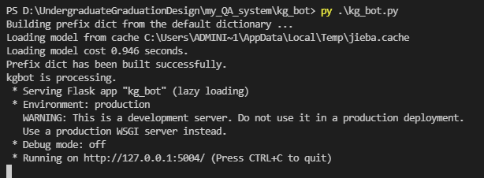
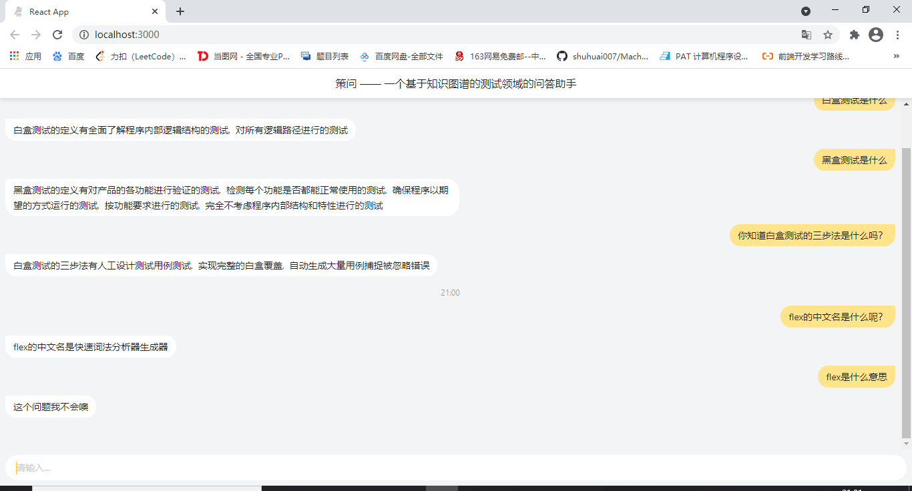
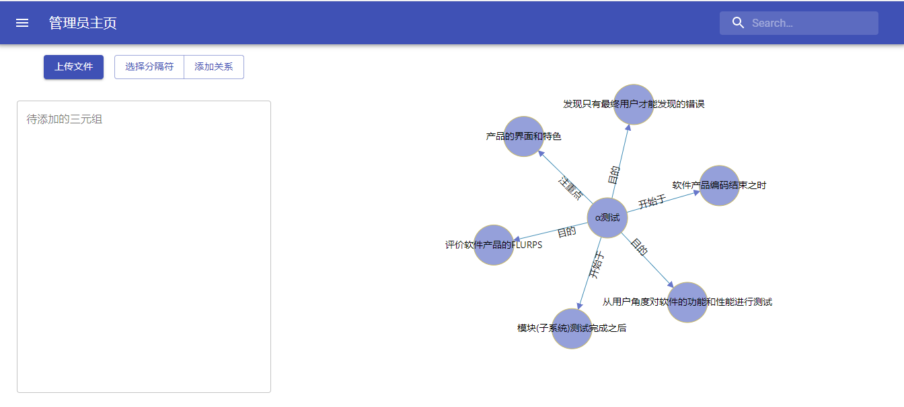
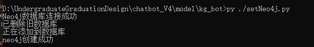

## 环境配置

1. Python环境配置安装

   - Python3（3.9.4）
   - flask（1.1.2）
   - jieba（0.42.1）
   - py2neo（2021.0.1）
2. Neo4j Desktop

3. 前端环境配置
   *  Node.js（v14.16.1）
   * npm（6.14.12）

## 运行指南

1. 打开cmd进入my-app文件夹下，输入

   ```
   npm install
   ```

   安装前端需要的js的代码模块。这个可能需要很长时间，此时，可以进行下一步操作，等到安装完成后，再输入

   ```
   npm start
   ```

   会自动再浏览器打开前端页面。

2. 打开Neo4j Desktop，新建一个数据库，设置密码为1114。创建好后启动数据库。如下图所示。

  如果设置了其他的密码，需要在代码中修改。要修改的文件是是db文件夹下的两个文件，要修改的语句如下：

  ```python
  graph = Graph("http://localhost:7474",auth=("neo4j","1114"))
  ```

  

3. 将数据导入数据库中。命令行进入kg_bot\db  目录下，输入

   ```
   python ./setNeo4j.py
   ```

4. 数据库保持启动状态，启动服务器。命令行回到kg_bot目录下，输入

   ```
   python ./kg_bot.py
   ```

   看到如下界面，则表示服务器启动成功。至此，整个项目启动完毕，可以正常运行。
   
   

## 前端展示






## 数据库展示




## bug

1. 画知识图谱的时候会不停挪移
2. 前端管理员界面输入字符的时候会左右横跳
3. 前面有很多输入内容的时候，再输入一个关系，会出现等很久的情况，后台重复构建了许多相同的template。
